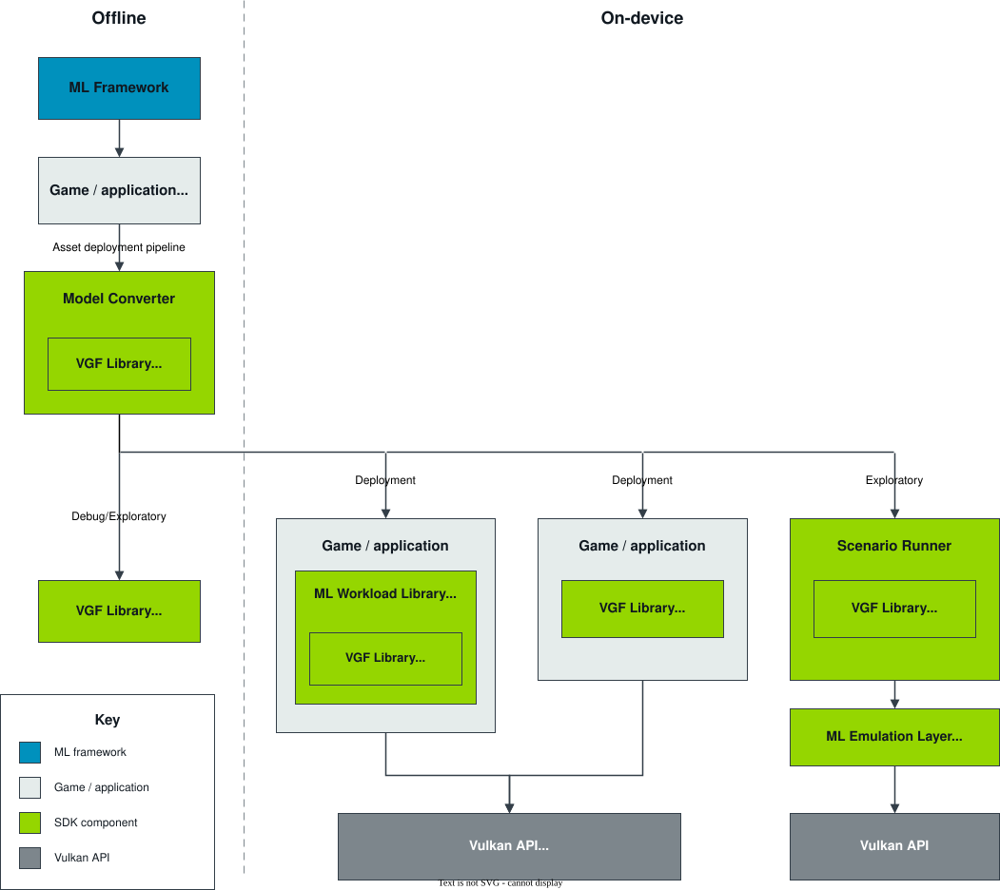

Introduction
============

The |SDK_project| is a collection of libraries and tools consisting of various components:

• :ref:`ML SDK Model Converter`
• :ref:`ML SDK VGF Library`
• :ref:`ML SDK Scenario Runner`
• :ref:`ML Emulation Layer for Vulkan®`
• :ref:`ML Workload Library for Vulkan®`

The following figure shows how you can use each of the ML SDK for Vulkan® components in a larger system:

The following gives a brief introduction to each of the ML SDK for Vulkan® components:

**Model Converter**
    Converts TOSA models into SPIR-V™ graphs and packages the whole use case into a
    VGF file. The Model Converter must be used as part of an asset pipeline
    deployment flow and is separated into two stages:

    1. The framework specific conversion mechanism lowers the framework model to a TOSA intermediate representation
    (not part of the |SDK_project|).

    2. The Model Converter applies additional transforms and optimizations before lowering to SPIR-V™ graph
    intermediate representation (IR) and then packaging the use case into a :code:`.vgf` file.

**VGF Library**
    A simple, efficient container format for ML use cases consisting of SPIR-V™ graphs, custom shaders,
    and constant data. This component provides:

    - A C++ encoder and decoder API for writing and efficiently reading VGF files.
    - A C decoder wrapper API to provide stable ABI bindings.
    - A VGF Dump Tool for working with VGF files.

    The VGF Library is intended for integration into game engines. The library has been designed around
    efficient decoding of the VGF file at runtime by supporting memory mapped file access (optional). The
    library requires user managed memory allocation to minimise copying and in-memory duplication of
    potentially large constant data.

**Scenario Runner**
    A data driven test and validation tool for executing ML workloads described in
    JSON scenario files.

**Emulation layer**
    A TOSA compliant, compute-based implementation exposed using Vulkan® Layers.
    The Emulation Layer currently exposes `VK_ARM_tensors`,
    `VK_ARM_data_graph`, `VK_ARM_data_graph_instruction_set_tosa`, and
    `VK_ARM_data_graph_optical_flow`. The corresponding SPIR-V™ extensions and extended instruction sets currently in
    use are `SPV_ARM_graph`, `SPV_ARM_tensors`, `TOSA.001000.1` and `Arm.MotionEngine.100`.

**Workload Library**
    Provides a C++ runtime API for constructing VGF-backed or standalone
    compute and data-graph workloads. Applications can use an existing Vulkan®
    context or let the library create one, bind application-owned or
    library-allocated resources, and run the workload or record it into an
    application command buffer.

In addition to these components, you will find documentation, tutorials, samples, and tests.

Production
----------

The proposed production workflow involves integrating the ML SDK Model Converter into the
application or game :code:`asset deployment pipeline`. The pipeline needs a TOSA intermediate
representation of a framework specific native model file. To obtain a TOSA intermediate
representation, you should use a specific framework to TOSA converter (not depicted here).
For example:

- `TOSA converter for TFLite <https://gitlab.arm.com/tosa/tosa-converter-for-tflite>`_
- `ExecuTorch <https://github.com/pytorch/executorch>`_

The TOSA intermediate representation is then passed to the ML SDK Model Converter
to produce a :code:`.vgf` file. The VGF file contents can then be:

• Embedded into the game or application's native packaging format.
• Distributed as a file on disk as part of the normal platform specific application deployment flow.

.. tip::
    When exploring the API, a tight integration is not necessary because the Model Converter can work directly
    with the framework files. The ML SDK Scenario Runner can also parse the VGF file directly. We recommend
    passing the TOSA intermediate representation to the ML SDK Model Converter for smoother Model Authoring
    workflows when in production.

The application or game running on the device can choose the integration level
that fits its Vulkan® architecture:

• Integrate the ML Workload Library for Vulkan® for a higher-level execution
  path. It consumes VGF or programmatic workload descriptions, exposes their
  resource requirements, configures execution state, and either runs the
  workload or records it into an application command buffer.

• Integrate the :code:`ML SDK VGF Library decoder` directly when the application
  needs full control over translating VGF metadata into Vulkan® objects and
  commands.

.. note::
    The ML SDK VGF Library does not call the Vulkan® API. In the direct decoder
    integration path, the application must translate the parsed information
    into Vulkan® API calls, including memory allocation, resource and pipeline
    creation, synchronization, and session management.

Exploration
-----------

When exploring the viability of a ML use case or API integration, it can be useful to first explore the use
case for the ML SDK Scenario Runner. The ML SDK Scenario Runner allows running use cases in a declarative manner before
working on more complicated feature integrations.

The ML Workload Library for Vulkan® samples provide the next step for exploring
C++ application integration, including VGF inspection and execution,
standalone compute and data-graph workloads, and application-owned Vulkan®
contexts. No ML SDK executable currently integrates the library on behalf of
an application.

.. tip::
    While the API is relatively new, we recommend you use the ML Emulation Layer for Vulkan® for exploration. The Emulation Layer
    provides a TOSA conformant software implementation of `VK_ARM_tensors`,
    `VK_ARM_data_graph`, `VK_ARM_data_graph_instruction_set_tosa`, and
    `VK_ARM_data_graph_optical_flow`, together with support for the
    `SPV_ARM_graph` and `SPV_ARM_tensors` SPIR-V™ extensions, and `TOSA.001000.1` and `Arm.MotionEngine.100` extended instruction sets. The
    Emulation Layer is enabled by the Vulkan® Layer mechanism.

    Another useful tool for exploration and debugging is the VGF Dump Tool. The VGF Dump Tool allows a developer
    to extract specific elements of the VGF file or even generate a template scenario description for a VGF file.

Platforms
---------

This table represents the status of platform support: supported (|/|), unsupported (|x|) and not applicable (|-|).
We will increase support in the upcoming releases.

+--------------------+-----------+----------+----------+-----------+-----------+
| Platforms          | Model     |  VGF     | Scenario | Emulation | Workload  |
|                    | Converter |  Library | Runner   | Layer     | Library   |
+==========+=========+===========+==========+==========+===========+===========+
| Linux    | AArch64 | |/|       | |/|      | |/|      | |/|       | |/|       |
+          +---------+-----------+----------+----------+-----------+-----------+
|          | X86-64  | |/|       | |/|      | |/|      | |/|       | |/|       |
+----------+---------+-----------+----------+----------+-----------+-----------+
| Windows® | AArch64 | |x|       | |x|      | |x|      | |x|       | |x|       |
+          +---------+-----------+----------+----------+-----------+-----------+
|          | X86-64  | |/|       | |/|      | |/|      | |/|       | |/|       |
+----------+---------+-----------+----------+----------+-----------+-----------+
| Darwin   | AArch64 | |/|       | |/|      | |/| *    | |/| *     | |/| *     |
+          +---------+-----------+----------+----------+-----------+-----------+
|          | X86-64  | |x|       | |x|      | |x|      | |x|       | |x|       |
+----------+---------+-----------+----------+----------+-----------+-----------+
| Android™ | AArch64 | |-|       | |/| **   | |/| **   | |/| **    | |/| **    |
+          +---------+-----------+----------+----------+-----------+-----------+
|          | X86-64  | |-|       | |x|      | |x|      | |x|       | |x|       |
+----------+---------+-----------+----------+----------+-----------+-----------+

\*  Experimental |SDK_project| support via MoltenVK or KosmicKrisp.
See :ref:`darwin-support` for
prerequisites, driver selection, and current limitations.

\** Initial Experimental support on Android™.

See details of limitations in the "Known Limitations" section of each component.

Tensor Data Types
-----------------

This table summarizes single-channel tensor element formats that are currently
handled by the ML SDK Model Converter, ML SDK Scenario Runner, ML Emulation
Layer for Vulkan®, and ML Workload Library for Vulkan®.

The ML SDK VGF Library is not listed because it stores encoded tensor format
metadata without adding data type-specific validation rules.

This table represents the status of tensor data type support: supported (|/|)
and unsupported (|x|).

+--------------------+-----------+----------+-----------+----------+
| Tensor data type   | ML SDK    | ML SDK   | ML SDK    | Workload |
|                    | Model     | Scenario | Emulation | Library  |
|                    | Converter | Runner   | Layer     |          |
+====================+===========+==========+===========+==========+
| bool               | |/|       | |/|      | |/|       | |/|      |
+--------------------+-----------+----------+-----------+----------+
| uint8              | |/|       | |/|      | |/|       | |/|      |
+--------------------+-----------+----------+-----------+----------+
| int8               | |/|       | |/|      | |/|       | |/|      |
+--------------------+-----------+----------+-----------+----------+
| uint16             | |/|       | |/|      | |/|       | |/|      |
+--------------------+-----------+----------+-----------+----------+
| int16              | |/|       | |/|      | |/|       | |/|      |
+--------------------+-----------+----------+-----------+----------+
| uint32             | |/|       | |/|      | |/|       | |/|      |
+--------------------+-----------+----------+-----------+----------+
| int32              | |/|       | |/|      | |/|       | |/|      |
+--------------------+-----------+----------+-----------+----------+
| int64              | |/|       | |/|      | |/|       | |/|      |
+--------------------+-----------+----------+-----------+----------+
| float16            | |/|       | |/|      | |/|       | |/|      |
+--------------------+-----------+----------+-----------+----------+
| float32            | |/|       | |/|      | |/|       | |/|      |
+--------------------+-----------+----------+-----------+----------+
| BFloat16           | |/|       | |/|      | |/|       | |/|      |
+--------------------+-----------+----------+-----------+----------+
| Float8E4M3         | |/|       | |/|      | |/|       | |/|      |
+--------------------+-----------+----------+-----------+----------+
| Float8E5M2         | |/|       | |/|      | |/|       | |/|      |
+--------------------+-----------+----------+-----------+----------+

The Model Converter column reflects the VGF tensor formats it can emit after
lowering.

The Emulation Layer column reflects the tensor layer and the shared tensor
format handling used by the graph layer.

The Scenario Runner preserves the payload bytes for BFloat16 and the
Float8 encodings when reading and writing NumPy files, rather than converting
them to native NumPy floating-point scalar types.

The Workload Library represents these formats in its resource model and uses
them when creating Vulkan® tensor descriptions, allocations, and views. Actual
execution depends on the workload and the formats supported by the target
Vulkan® implementation.

Refer to :ref:`JSON Test Description Specification` for detailed Scenario
Runner data type support information.
